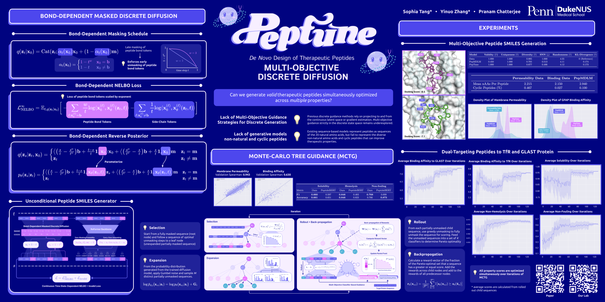

# [PepTune: De Novo Generation of Therapeutic Peptides with Multi-Objective-Guided Discrete Diffusion](https://arxiv.org/abs/2412.17780) 🧬🔮 [ICML 2025]


[**Sophia Tang**](https://sophtang.github.io/)\*, [**Yinuo Zhang**]()\* and [**Pranam Chatterjee**](https://www.chatterjeelab.com/)



This is the repository for **[PepTune: De Novo Generation of Therapeutic Peptides with Multi-Objective-Guided Discrete Diffusion](https://arxiv.org/abs/2412.17780)** 🧬🔮 published at **ICML 2025**. It is partially built on the **[MDLM repo](https://github.com/kuleshov-group/mdlm)** ([Sahoo et al. 2024](https://arxiv.org/abs/2406.07524)).

PepTune leverages **Monte-Carlo Tree Search (MCTS)** to guide a generative masked discrete diffusion model which iteratively refines a set of Pareto non-dominated sequences optimized across a set of therapeutic properties, including binding affinity, cell membrane permeability, solubility, non-fouling, and non-hemolysis.

## Environment Installation

```bash
conda env create -f src/environment.yml

conda activate peptune
```

## Model Pretrained Weights Download

Follow the steps below to download the model weights required for this experiment.

1. Download the PepTune pre-trained MDLM checkpoint and place in `checkpoints/`: https://drive.google.com/file/d/1oXGDpKLNF0KX0ZdOcl1NZj5Czk2lSFUn/view?usp=sharing
2. Download the pre-trained binding affinity Transformer model and place in `src/scoring/functions/classifiers/`: https://drive.google.com/file/d/128shlEP_-rYAxPgZRCk_n0HBWVbOYSva/view?usp=sharing

## Training Data Download

Download the peptide training dataset from _ and unzip it into the `data/` directory:

```bash
# Download peptide_data.zip into the data/ directory
cd data/

# Unzip the training data
unzip peptide_data.zip

cd ..
```

After unzipping, the data should be located at `data/peptide_data/`.

## Repository Structure

```
PepTune/
├── src/
│   ├── train_peptune.py          # Main training script
│   ├── generate_mcts.py          # MCTS-guided peptide generation
│   ├── generate_unconditional.py # Unconditional generation
│   ├── diffusion.py              # Core masked discrete diffusion model
│   ├── pareto_mcts.py            # Pareto-front MCTS implementation
│   ├── roformer.py               # RoFormer backbone
│   ├── noise_schedule.py         # Noise scheduling (loglinear, logpoly)
│   ├── config.yaml               # Hydra configuration
│   ├── config.py                 # Argparse configuration
│   ├── environment.yml           # Conda environment
│   ├── scoring/                  # Therapeutic property scoring
│   │   ├── scoring_functions.py  # Unified scoring interface
│   │   └── functions/            # Individual property predictors
│   │       ├── binding.py
│   │       ├── hemolysis.py
│   │       ├── nonfouling.py
│   │       ├── permeability.py
│   │       ├── solubility.py
│   │       └── classifiers/      # Pre-trained scoring model weights
│   ├── tokenizer/                # SMILES SPE tokenizer
│   │   ├── my_tokenizers.py
│   │   ├── new_vocab.txt
│   │   └── new_splits.txt
│   └── utils/                    # Utilities & PeptideAnalyzer
│       ├── app.py
│       ├── generate_utils.py
│       └── utils.py
├── scripts/                      # Shell scripts for running experiments
│   ├── train.sh                  # Pre-training
│   ├── generate_mcts.sh          # MCTS-guided generation
│   └── generate_unconditional.sh # Unconditional generation
├── data/                         # Training data
│   ├── dataloading_for_dynamic_batching.py
│   └── dataset.py
├── checkpoints/                  # Model checkpoints
└── assets/                       # Figures
```

## Pre-training

Before running, fill in `HOME_LOC` and `ENV_LOC` in `scripts/train.sh` and `base_path` in `src/config.yaml` to match your paths.

```bash
chmod +x scripts/train.sh

nohup ./scripts/train.sh > train.log 2>&1 &
```

Training uses Hydra configuration from `src/config.yaml`. Key settings:
- **Backbone:** RoFormer (768 hidden, 8 layers, 12 heads)
- **Optimizer:** AdamW (lr=3e-4, weight_decay=0.075)
- **Data:** 11M SMILES peptide dataset with dynamic batching by length
- **Precision:** fp64
- Checkpoints saved to `checkpoints/` (monitors `val/nll`, saves top 10)

## MCTS-Guided Peptide Generation

Generate therapeutic peptides optimized across multiple objectives using Monte-Carlo Tree Search.

1. Fill in `base_path` in `src/config.yaml` and `src/scoring/scoring_functions.py`.
2. Fill in `HOME_LOC` in `scripts/generate_mcts.sh`.
3. Create output directories: `mkdir -p results logs`

```bash
chmod +x scripts/generate_mcts.sh

# Usage: ./scripts/generate_mcts.sh [PROT_NAME] [PROT_NAME2] [MODE] [MODEL] [LENGTH] [EPOCH]
# Example: Generate peptides targeting GFAP with length 100
nohup ./scripts/generate_mcts.sh gfap "" 2 mcts 100 7 > generate.log 2>&1 &
```

### Available Target Proteins

| Name | Target |
|------|--------|
| `amhr` | AMH Receptor |
| `tfr` | Transferrin Receptor |
| `gfap` | Glial Fibrillary Acidic Protein |
| `glp1` | GLP-1 Receptor |
| `glast` | Excitatory Amino Acid Transporter |
| `ncam` | Neural Cell Adhesion Molecule |
| `cereblon` | Cereblon (CRBN) |
| `ligase` | E3 Ubiquitin Ligase |
| `skp2` | S-Phase Kinase-Associated Protein 2 |
| `p53` | Tumor Suppressor p53 |
| `egfp` | Enhanced Green Fluorescent Protein |

To specify a custom target protein, override `+prot_seq=<amino acid sequence>` and `+prot_name=<name>` as Hydra arguments in the generation script.

### Scoring Objectives

PepTune jointly optimizes across five therapeutic properties via the integrated scoring suite:

| Objective | Property | Model |
|-----------|----------|-------|
| `binding_affinity1` | Binding affinity to target protein | Cross-attention Transformer |
| `solubility` | Aqueous solubility | XGBoost on SMILES CNN embeddings |
| `hemolysis` | Non-hemolytic | SMILES binary classifier |
| `nonfouling` | Non-fouling | SMILES binary classifier |
| `permeability` | Cell membrane permeability | PAMPA CNN |

### Key MCTS Parameters

These can be overridden via Hydra config overrides:

| Parameter | Default | Description |
|-----------|---------|-------------|
| `mcts.num_children` | 50 | Branching factor per MCTS node |
| `mcts.num_iter` | 128 | Number of MCTS iterations |
| `mcts.topk` | 100 | Top-k sequences to retain |
| `mcts.num_objectives` | 5 | Number of optimization objectives |
| `mcts.sampling` | 0 | Sampling strategy (0=Gumbel, >0=top-k) |
| `mcts.invalid_penalty` | 0.5 | Penalty for invalid peptides |
| `mcts.perm` | True | Permutation denoising mode |
| `sampling.steps` | 128 | Diffusion denoising steps |
| `sampling.seq_length` | 100 | Generated peptide length |

## Unconditional Generation

Generate peptides without property guidance:

```bash
chmod +x scripts/generate_unconditional.sh

nohup ./scripts/generate_unconditional.sh > generate_unconditional.log 2>&1 &
```

## Evaluation

To summarize metrics after generation, fill in `path` and `prot_name` in `src/metrics.py` and run:

```bash
python src/metrics.py
```

## Citation

If you find this repository helpful for your publications, please consider citing our paper:

```bibtex
@article{tang2025peptune,
  title={Peptune: De novo generation of therapeutic peptides with multi-objective-guided discrete diffusion},
  author={Tang, Sophia and Zhang, Yinuo and Chatterjee, Pranam},
  journal={42nd International Conference on Machine Learning},
  year={2025}
}
```

## License

To use this repository, you agree to abide by the MIT License.
